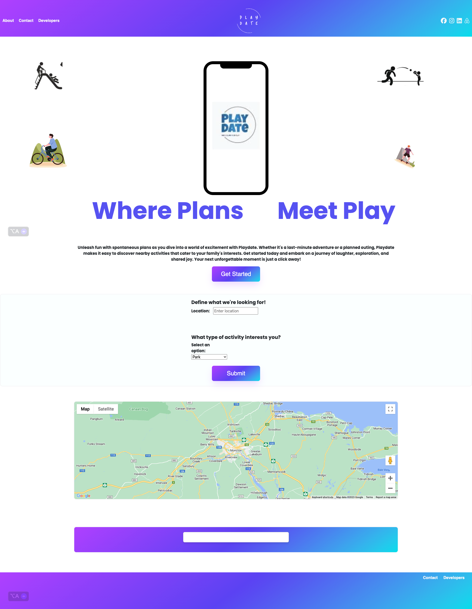

# Play Date

## Project Overview
What sets PlayDate apart is our user-friendly platform, offering personalized recommendations tailored to your family's interests. Say goodbye to the same old weekend routines and hello to spontaneous family adventures, laughter, and exploration. Whether you're discovering a local museum, taking a leisurely park walk, or seeking thrills at amusement parks, PlayDate is your go-to companion.

### Upcoming Iterations
1. To be determined

### Image of the Application

### Play Date Video
Unavailable

### Resources and Tools
- **Google Places:** [Google Places API](https://mapsplatform.google.com/maps-products/#places-section)
- **Google Maps:** [Google Maps API](https://mapsplatform.google.com/maps-products/#maps-section)
- **Google Fonts:** [Google Fonts](https://fonts.google.com/)
- **MDN Web Docs:** [JavaScript resources](https://developer.mozilla.org/en-US/search?q=JavaScript)
- **Bootstrap:** [Bootstrap Documentation](https://getbootstrap.com/docs/5.1/getting-started/introduction/)

### Links
- **GitHub Repository:** [Play Date Repo](https://github.com/Maximilian93B/Play-Date)
- **Live Project:** [Play Date Live](https://maximilian93b.github.io/Play-Date/)

### Installation Instructions
N/A

## Contributors
- Maximilian Bosch: [GitHub](https://github.com/Maximilian93B/Play-Date)
- Ikechukwu Mbanugo: [GitHub](https://github.com/imbanu1)
- Stephanie Perroni: [GitHub](https://github.com/fswDevSteph/Play-Date)

## Handling CORS Issues
If you encounter CORS (Cross-Origin Resource Sharing) issues while running the app, consider using the "Allow CORS: Access-Control-Allow-Origin" extension for Chrome. This extension can help bypass CORS policies by modifying HTTP request headers. 

### Installation Guide for CORS Extension
1. Visit the Chrome Web Store.
2. Search for "Allow CORS: Access-Control-Allow-Origin".
3. Add the extension to your Chrome browser.
4. Enable the extension when running the app.

**Note:** This is a temporary solution for development purposes and should be used cautiously as it can have security implications.

## Known Issues
Google Maps may not work on GitHub Live version. Could be API Key issue. Clone repo and open in Chrome with Ext if you cannot see the Maps. 

## Development Team
- Maximilian Bosch: [GitHub](https://github.com/Maximilian93B/Play-Date)
- Ikechukwu Mbanugo: [GitHub](https://github.com/imbanu1)
- Stephanie Perroni: [GitHub](https://github.com/fswDevSteph/Play-Date)
